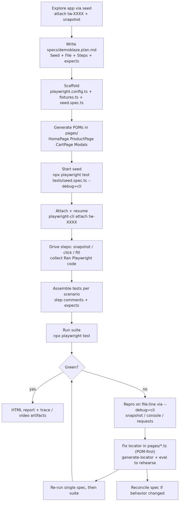

# playwright-cli-demo

Playwright Test Runner + `playwright-cli` for agentic QA on the Demoblaze demo store (`https://www.demoblaze.com`).
The runner owns deterministic execution and CI; `playwright-cli` owns interactive exploration, test generation,
and healing — bridged by `npx playwright test --debug=cli`.

- Test plan: `specs/demoblaze.plan.md` (14 scenarios, 5 groups)
- Page objects: `pages/` (HomePage, ProductPage, CartPage, Modals)
- Tests: `tests/` (14 scenario specs + `tests/seed.spec.ts`), one test per file
- Deep guides: `docs/DEBUG_CLI_GUIDE.md` (full), `docs/DEBUG_CLI_CHEATSHEET.md` (one-pager),
  `docs/DEBUG_CLI_DEMO.sh` (runnable lifecycle), `docs/debug-cli-trace-example.md` (tracing)
- Design + strategy: `docs/HLD.md`, `docs/COMPARISON.md` (combo vs manual vs MCP-driven QA)

---

## 1. Setup

Prerequisites: **Node.js 20+** and npm.

```bash
npm ci
npx playwright install --with-deps chromium
# playwright-cli: global install, or fall back to the local runner copy
npm install -g @playwright/cli@latest   # preferred for agents
playwright-cli --help
# fallback when global install is unavailable:
npx --no-install playwright cli --help
```

Agent permissions for this repo are pre-approved in `opencode.json:1-10`
(`playwright-cli *`, `npx *`, `npm *`).

Useful verification (no test harness needed):

```bash
playwright-cli open https://www.demoblaze.com --headed
playwright-cli snapshot
playwright-cli close
```

> Always prefix test runs with `PLAYWRIGHT_HTML_OPEN=never` so the HTML reporter
> (`playwright.config.ts:9`, `open: 'never'`) never blocks waiting for input.

---

## 2. Commands

| What | Command |
|---|---|
| Full suite | `PLAYWRIGHT_HTML_OPEN=never npx playwright test` (`package.json:5`) |
| Full suite (npm script) | `npm test` |
| Debug mode (CLI bridge) | `npm run test:debug` → `playwright test --debug=cli` (`package.json:6`) |
| Single file | `PLAYWRIGHT_HTML_OPEN=never npx playwright test tests/cart/add-single-product-to-cart.spec.ts` |
| Debug one failure | `PLAYWRIGHT_HTML_OPEN=never npx playwright test tests/catalog/filter-by-phone-category.spec.ts --debug=cli` |
| View a trace | `npx playwright show-trace docs/.trace-placeholder` (traces land in `.playwright-cli/traces/`, gitignored) |
| Lifecycle demo (dry-run) | `./docs/DEBUG_CLI_DEMO.sh` |
| Lifecycle demo (live browser) | `./docs/DEBUG_CLI_DEMO.sh --live` |

Core `playwright-cli` verbs (each action prints the equivalent Playwright TypeScript):

```bash
playwright-cli snapshot                  # a11y tree with refs e1..eN
playwright-cli find "Add to cart"        # grep snapshot with context
playwright-cli click e5
playwright-cli fill e3 "Test User"       # add --submit to press Enter after fill
playwright-cli press Enter
playwright-cli hover e4
playwright-cli select e9 "USA"
playwright-cli --raw generate-locator e5            # locator for expect()
playwright-cli --raw eval "el => el.textContent" e5 # expected value for assertions
playwright-cli console                   # console console-warning filter: console warning
playwright-cli requests                  # network table; request N for detail
playwright-cli tracing-start / tracing-stop
playwright-cli video-start demo.webm / video-chapter "Title" / video-stop
playwright-cli state-save auth.json / state-load auth.json
playwright-cli cookie-list / localstorage-list / sessionstorage-list
playwright-cli close
```

Full catalog: `.opencode/skills/playwright-cli/SKILL.md`.

---

## 3. Workflow

### 3.1 Plan — write the spec first

Explore the app through the **seed** (never bare `playwright-cli open <url>`, which skips
fixtures/`baseURL`/auth), then freeze findings in `specs/demoblaze.plan.md`:

```bash
PLAYWRIGHT_HTML_OPEN=never npx playwright test tests/seed.spec.ts --debug=cli &
playwright-cli attach tw-XXXX
playwright-cli resume                   # fixture runs tests/fixtures.ts:6 -> goto('/')
playwright-cli snapshot                 # inventory: links, buttons, modals, grid
playwright-cli click e12                # follow flows, note URLs/text/prices
playwright-cli eval "location.href"
# ... repeat until surfaces are mapped ...
playwright-cli close
kill %1; wait %1 2>/dev/null || true
```

Spec format (`specs/demoblaze.plan.md:1-60`):

```markdown
### 1. Catalog and Navigation
**Seed:** `tests/seed.spec.ts`
#### 1.1. filter-by-phone-category
**File:** `tests/catalog/filter-by-phone-category.spec.ts`
**Steps:**
  1. Click link "Phones" in categories sidebar
    - expect: grid shows only phone products including "Samsung galaxy s6"
```

Rules: one scenario starts fresh from the seed (never chained), kebab-case names match file names,
user-level steps, every observable outcome as an `- expect:` bullet (each becomes an assertion).

### 3.2 Scaffold — config, fixture, seed

- `playwright.config.ts:3-22` — `testDir: './tests'`, `workers: 1`, `fullyParallel: false`
  (cart state is global/localStorage), `retries: 0` (heal loop instead),
  `baseURL: 'https://www.demoblaze.com'`, `trace: 'on-first-retry'`,
  `screenshot: 'only-on-failure'`, single Chromium project.
- `tests/fixtures.ts:4-8` — the only fixture: overrides `page` to `goto('/')`, re-exports `expect`.
- `tests/seed.spec.ts:1-7` — empty `test('seed')`; exists only as the `--debug=cli` attach point.

### 3.3 Generate POMs — locators live here, once

One class per page/modal; locators declared in the constructor; semantic `getByRole` first,
stable `#id` selectors where the app provides them:

| POM | Covers | Locator highlights |
|---|---|---|
| `pages/HomePage.ts:20-35` | Navbar, categories, carousel, grid | `getByRole('link', { name, exact: true })`, carousel scoped to `#carouselExampleIndicators` |
| `pages/ProductPage.ts:12-15` | `prod.html?idp_=N` detail | `locator('h2')`, `h3.price-container`, `getByRole('link', 'Add to cart')` |
| `pages/CartPage.ts:12-15` | `cart.html` | `locator('#tbodyid')`, `locator('#totalp')`, `getByRole('button', 'Place Order')` |
| `pages/Modals.ts:7-162` | Sign up / Log in / Contact / About / PlaceOrder | `#sign-username`, `#orderModal` inputs, modal-scoped `Close`, `.last()` for duplicates |

Harvest locators with `playwright-cli --raw generate-locator eN`, then harden
(`exact: true`, modal/region scoping). Reusable behaviors become methods, e.g.
`ProductPage.addToCartAndAcceptAlert()` (`pages/ProductPage.ts:24-36`),
`CartPage.expectLoaded()` (`pages/CartPage.ts:22-25`), `PlaceOrderModal.fillOrder()`.

### 3.4 Generate spec files — emitted code + manual assertions

One scenario at a time (sequential — scenarios share the seed session), restart the seed between scenarios:

```bash
PLAYWRIGHT_HTML_OPEN=never npx playwright test tests/seed.spec.ts --debug=cli &
playwright-cli attach tw-XXXX
playwright-cli resume
playwright-cli snapshot
playwright-cli click e18   # -> await page.getByRole('link', { name: 'Samsung galaxy s6', exact: true }).click();
playwright-cli eval "location.href"   # -> https://www.demoblaze.com/prod.html?idp_=1
playwright-cli --raw generate-locator e22   # locator for the assertion
playwright-cli --raw eval "el => el.textContent" e22  # expected value
playwright-cli close
kill %1; wait %1 2>/dev/null || true
```

Assemble at the path from the spec (`tests/cart/add-single-product-to-cart.spec.ts:1-38`):

```ts
// spec: specs/demoblaze.plan.md
// seed: tests/seed.spec.ts
import { test, expect } from '../fixtures';
import { HomePage } from '../../pages/HomePage';

test.describe('Cart Operations', () => {
  test('add-single-product-to-cart', async ({ page }) => {
    const home = new HomePage(page);
    // 1. Click link "Samsung galaxy s6" on homepage
    await home.openProduct('Samsung galaxy s6');
    await expect(page).toHaveURL(/.*prod\.html\?idp_=1/);
    // ...
  });
});
```

Rules: one test per file, `describe` name verbatim from the spec, `// N. <step>` comments,
import from `../fixtures`, `- expect:` bullets become
`toBeVisible` / `toHaveText` / `toHaveValue` / `toHaveURL` / `toBeHidden` / `toMatchAriaSnapshot`.
Then run it: `PLAYWRIGHT_HTML_OPEN=never npx playwright test tests/<group>/<scenario>.spec.ts`.

---

## 4. Runner + `--debug=cli`: the bridge

`--debug=cli` pauses the worker **inside** the test and exposes its exact `page`/`context`
as a `tw-XXXX` session the CLI can drive (`docs/DEBUG_CLI_GUIDE.md:43-66`):

```bash
PLAYWRIGHT_HTML_OPEN=never npx playwright test tests/seed.spec.ts --debug=cli &
# wait for: Debugging Instructions: playwright-cli attach tw-XXXX
playwright-cli attach tw-XXXX
playwright-cli resume                 # seed body runs, page lands on baseURL
playwright-cli snapshot               # refs e1..eN for this exact page
playwright-cli click e5               # Ran Playwright code: await page.getByRole(...).click();
playwright-cli console / requests     # live devtools on the test's page
playwright-cli tracing-start          # composable: trace + video inside the same session
playwright-cli tracing-stop           # -> .playwright-cli/traces/trace-*.trace + .network
playwright-cli close
kill %1; wait %1 2>/dev/null || true
```

Why not just `playwright-cli open <url>`? The standalone browser has no `baseURL`,
no fixtures, no `storageState`, no seeding side-effects — locators harvested there
diverge from what the failing test sees (`docs/DEBUG_CLI_GUIDE.md:118-130`).
Always generate and heal through the seed.

---

## 5. Debug by fixing POMs and locators — not test files

**Principle:** tests contain flow + assertions only; every selector lives in `pages/*.ts`.
A locator fix in one POM heals every spec that uses it. When a test fails:

```bash
PLAYWRIGHT_HTML_OPEN=never npx playwright test tests/cart/remove-product-from-cart.spec.ts --debug=cli &
playwright-cli attach tw-XXXX
playwright-cli resume
playwright-cli snapshot               # element moved / renamed?
playwright-cli find "Delete"          # grep with context
playwright-cli console                # app-side error?
playwright-cli requests               # failed payload?
playwright-cli --raw generate-locator e14        # candidate replacement
playwright-cli --raw eval "el => el.textContent" e14
```

The three canonical fixes in this repo (all POM-side):

1. **Strict-mode violation** — `getByRole('button', { name: 'Close' })` matches every modal.
   Fix in the POM: scope (`aboutModal.getByRole(...)`), `.last()`, or `getByLabel('Close')`
   with `.close` fallback (`pages/Modals.ts:31,46,92`); nav links use `{ exact: true }`
   (`pages/HomePage.ts:24-28`). Test files untouched.
2. **Dialog race** — handler registered after the click misses the alert.
   Fix in the POM helper (`pages/ProductPage.ts:24-36`):
   ```ts
   const dialogPromise = page.waitForEvent('dialog'); // BEFORE the click
   await product.addToCartLink.click();
   const dialog = await dialogPromise;
   expect(dialog.message()).toBe('Product added');
   await dialog.accept();
   ```
3. **Async cart render** — table populates after navigation.
   Fix with guards, never sleeps/`networkidle`: `CartPage.expectLoaded()` waits for
   `Place Order` (`pages/CartPage.ts:22-25`); delete asserts
   `toBeHidden({ timeout: 10000 })`.

After the POM fix: `kill %1`, re-run the single spec, then the suite.
Reconcile `specs/demoblaze.plan.md` only if user-visible behavior changed
(technical drift → leave the spec; ambiguous change → ask with scenario id + snapshot excerpt).
Full recipes: `docs/DEBUG_CLI_GUIDE.md:416-498`.

---

## 6. Time and cost savings (qualitative)

No live measurements were taken for these claims; they follow from the workflow mechanics
(see `docs/COMPARISON.md` for the full 4-way analysis vs manual and MCP-driven QA).

| Where | Without this workflow | With runner + CLI combo |
|---|---|---|
| Authoring 14 scenarios | Hand-write every locator after DevTools spelunking | Drive each step once; paste emitted `getByRole` locators into POMs/specs |
| Locator drift (e.g. modal rename) | Patch N spec files that hard-code the selector | Patch 1 POM constructor; all specs heal |
| Dialog/timing flakiness | Debug via rerun + trace round-trips | Reproduce live in `tw-XXXX`, rehearse the `waitForEvent`/guard fix, paste it |
| Agent context cost | Full a11y trees + tool schemas inline every turn (MCP-style) | Terse commands; snapshots spill to `.playwright-cli/*.yml`; `--raw` pipes to `jq`/`diff` |
| CI confidence | Interactive sessions evaporate | Every behavior lands as a committed `*.spec.ts` with `trace: on-first-retry` evidence |

---

## 7. Workflow in full detail




Render/update the PNG with the pre-installed Mermaid CLI (no extra skill needed):

```bash
npx mmdc -i /tmp/readme-workflow.mmd -o docs/readme-workflow.png -b white -w 1600
```

---

## 8. Project map

```
.
├── README.md                     # this file
├── package.json                  # test / test:debug scripts, @playwright/test ^1.62.1
├── playwright.config.ts          # baseURL, workers=1, trace on-first-retry
├── opencode.json                 # pre-approved CLI permissions for agents
├── specs/demoblaze.plan.md       # single source of truth (5 groups, 14 scenarios)
├── pages/                        # POMs: HomePage, ProductPage, CartPage, Modals
├── tests/                        # fixtures.ts, seed.spec.ts, catalog/ cart/ auth/ misc/ checkout/
├── docs/                         # tracked docs (moved out of gitignored reports/ + debug-cli-showcase/)
│   ├── DEBUG_CLI_GUIDE.md        # complete --debug=cli guide + 3 recipes
│   ├── DEBUG_CLI_CHEATSHEET.md   # one-page copy-paste reference
│   ├── DEBUG_CLI_DEMO.sh         # runnable lifecycle demo (dry-run / --live)
│   ├── debug-cli-trace-example.md# tracing + console + requests deep-dive
│   ├── HLD.md / HLD.pdf          # high-level design + architecture diagrams
│   ├── COMPARISON.md             # combo vs manual vs MCP-driven QA
│   └── readme-workflow.png       # rendered §7 diagram
└── .opencode/skills/playwright-cli/  # installed skill: SKILL.md + 9 references
```

Scenario → file → POM mapping and locator/dialog/timing patterns: `docs/HLD.md:419-530`.

## 9. Skills used (via `find-skills`)

- `microsoft/playwright-cli` — already installed (`.opencode/skills/playwright-cli/`); provides the
  CLI catalog and the plan → generate → heal contract (`references/test-generation.md`,
  `references/playwright-tests.md`). No install step needed.
- Diagramming — evaluated skills.sh options (`imxv/Pretty-mermaid-skills`, `maxpetrusenko/skills@mermaid-diagrams`,
  `WH-2099/mermaid-skill`); chose the repo-pinned `@mermaid-js/mermaid-cli` instead since it is
  already a devDependency and rendered the existing HLD/showcase PNGs. No new dependency added.
