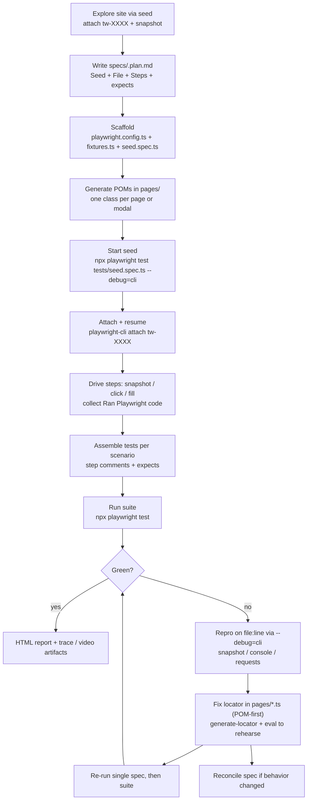

# playwright-cli-demo

A practical template for **agentic browser-test automation**: Playwright Test Runner owns
deterministic execution and CI, while `playwright-cli` gives you (or your AI agent) an
interactive browser to explore with, generate tests from, and debug in — bridged by
`npx playwright test --debug=cli`.

The committed example tests the **Demoblaze demo store** (`https://www.demoblaze.com`,
14 scenarios across catalog, cart, auth, contact/about, and checkout), but the method works
on **any public website** — point it at a new URL and follow the same loop (§3).

> **Working with an AI agent?** The agent-facing contract lives in `AGENTS.md`
> (plus a `CLAUDE.md` pointer). It tells Claude Code, Copilot CLI, or OpenCode exactly
> which skill references to load, which commands to run, and the rules to never break.
> This README is the human guide: what to ask for and how the whole thing works.

---

## 1. The idea in 60 seconds

1. **Plan** — explore the site in a live browser session and freeze what you find into a
   plain-English test plan (`specs/*.plan.md`).
2. **Model** — put every selector exactly once into page-object classes (`pages/*.ts`).
3. **Generate** — click through each planned scenario in the browser; every action prints the
   matching Playwright code, which becomes a spec file (`tests/`, one test per file).
4. **Run** — the Playwright runner executes the suite deterministically, with traces on failure.
5. **Heal** — when the site changes, reproduce the failure live, fix the **page object**
   (one place), re-run. Test files rarely need editing.

The key trick is `--debug=cli`: it pauses a real test run and hands its exact browser page
to `playwright-cli`, so everything you explore, generate, or fix happens in the identical
context the test will run in — same URL config, same login state, same fixtures.

---

## 2. Use it on any public website

The Demoblaze files are just the worked example. To cover a different site:

| Step | What to do | Example (Demoblaze, already done) |
|---|---|---|
| Point | Set `baseURL` in `playwright.config.ts` | `https://www.demoblaze.com` |
| Plan | Explore via the seed session (§4) and write `specs/<feature>.plan.md`: overview + scenarios with numbered steps and `- expect:` outcomes | `specs/demoblaze.plan.md` (5 groups, 14 scenarios) |
| Model | Create one class per page in `pages/` holding all selectors | `HomePage`, `ProductPage`, `CartPage`, `Modals` |
| Generate | Drive each scenario live, collect the printed code into `tests/<group>/<name>.spec.ts` | 14 spec files, e.g. `tests/cart/add-single-product-to-cart.spec.ts` |
| Run & heal | `npx playwright test`; fix page objects on drift (§5) | `workers: 1`, `trace: on-first-retry` |

Keep the scaffold files as-is: `tests/fixtures.ts` (navigates to `/` before each test) and
`tests/seed.spec.ts` (empty test that exists only as the `--debug=cli` attach point).

---

## 3. Setup

Prerequisites: **Node.js 20+** and npm.

```bash
npm ci
npx playwright install --with-deps chromium
# interactive browser CLI (global preferred; local fallback exists)
npm install -g @playwright/cli@latest
playwright-cli --help
```

> Always prefix test runs with `PLAYWRIGHT_HTML_OPEN=never` so the HTML reporter
> (`playwright.config.ts:9`) never blocks waiting for input.

---

## 4. Commands you'll actually use

| What | Command |
|---|---|
| Run the suite | `PLAYWRIGHT_HTML_OPEN=never npx playwright test` (or `npm test`) |
| Run one scenario | `PLAYWRIGHT_HTML_OPEN=never npx playwright test tests/cart/add-single-product-to-cart.spec.ts` |
| Debug a failure live | `PLAYWRIGHT_HTML_OPEN=never npx playwright test <file>:<line> --debug=cli`, then in a second terminal `playwright-cli attach tw-XXXX` → `resume` → `snapshot` |
| View a failure trace | `npx playwright show-trace <trace-file>` (traces land in `.playwright-cli/traces/`) |
| Try the lifecycle hands-free | `./docs/DEBUG_CLI_DEMO.sh` (dry-run) or `./docs/DEBUG_CLI_DEMO.sh --live` |

Inside a live session, the essentials are `snapshot` (see the page), `click`/`fill`/`press`
(do things — each prints its Playwright code), `find` (search the page),
`--raw generate-locator` + `--raw eval` (build assertions), and `console` / `requests`
(see what the app did). Full catalog: `docs/DEBUG_CLI_CHEATSHEET.md`.

---

## 5. Worked example: how a Demoblaze test came to be

Scenario `2.1. add-single-product-to-cart` (`specs/demoblaze.plan.md:64-76`):

1. **Planned** — clicking "Samsung galaxy s6" opens `prod.html?idp_=1`; "Add to cart" raises a
   `Product added` alert; the cart then shows the row with total `360`.
2. **Modeled** — product link and price live in `pages/HomePage.ts`, the cart link too;
   cart rows and totals live in `pages/CartPage.ts`.
3. **Generated** — each click was driven live and its printed code collected into
   `tests/cart/add-single-product-to-cart.spec.ts`, with `expect(page).toHaveURL(...)`,
   dialog-message, and cart-content assertions added per `- expect:` bullet.
4. **Healed once** — the alert raced the click, so the fix registers
   `page.waitForEvent('dialog')` *before* clicking (`pages/ProductPage.ts:24-36` pattern).
   One POM helper, all cart/checkout specs benefit.

When a locator drifts (a modal is renamed, a price wrapper is added), the same loop applies:
reproduce on `file:line` via `--debug=cli`, find the new element, patch the page object,
re-run. See `docs/DEBUG_CLI_GUIDE.md:416-498` for three worked healing recipes.

---

## 6. Asking your AI agent to do it

Give the agent a goal plus the skill name; the strict rules live in `AGENTS.md`, so prompts stay short:

- **Plan a new site:** "Using the playwright-cli skill, explore https://example.com through
  `tests/seed.spec.ts --debug=cli` and draft `specs/shop.plan.md` in the format of
  `specs/demoblaze.plan.md`. Don't write tests yet."
- **Generate a scenario:** "Using the playwright-cli skill, generate the spec for scenario 2.3
  of `specs/demoblaze.plan.md` via the seed session — one test per file, `// N.` step comments,
  import from `../fixtures` — then run it."
- **Heal a failure:** "Using the playwright-cli skill, heal this failure (paste output) POM-first:
  reproduce on `file:line` with `--debug=cli`, patch only `pages/`, re-run the spec then the suite."

What you'll get back: a plan file, new spec/POM files, or a minimal page-object diff —
always verified by a green re-run the agent shows you. Strategy comparison
(combo vs hand-written vs MCP-driven QA): `docs/COMPARISON.md`.

---

## 7. Workflow diagram




Re-render after edits with the pre-installed Mermaid CLI:

```bash
npx mmdc -i /tmp/readme-workflow.mmd -o docs/readme-workflow.png -b white -w 1600
```

---

## 8. Project map

```
.
├── AGENTS.md / CLAUDE.md             # agent contract (skill refs, hard rules, recipes)
├── README.md                         # this file (human guide)
├── playwright.config.ts              # baseURL, workers=1, trace on-first-retry
├── specs/demoblaze.plan.md           # worked-example test plan (5 groups, 14 scenarios)
├── pages/                            # page objects: HomePage, ProductPage, CartPage, Modals
├── tests/                            # fixtures.ts, seed.spec.ts, catalog/ cart/ auth/ misc/ checkout/
├── docs/                             # guides + design docs (all git-tracked)
│   ├── DEBUG_CLI_GUIDE.md            # complete --debug=cli guide + recipes
│   ├── DEBUG_CLI_CHEATSHEET.md       # one-page command reference
│   ├── DEBUG_CLI_DEMO.sh             # runnable lifecycle demo
│   ├── debug-cli-trace-example.md    # tracing + console + requests deep-dive
│   ├── HLD.md                        # high-level design + patterns (scenario map: HLD.md:419-530)
│   ├── COMPARISON.md                 # runner+CLI vs manual vs MCP-driven QA
│   └── readme-workflow.png           # rendered §7 diagram
└── .opencode/skills/playwright-cli/  # installed skill: SKILL.md + 9 references
```
