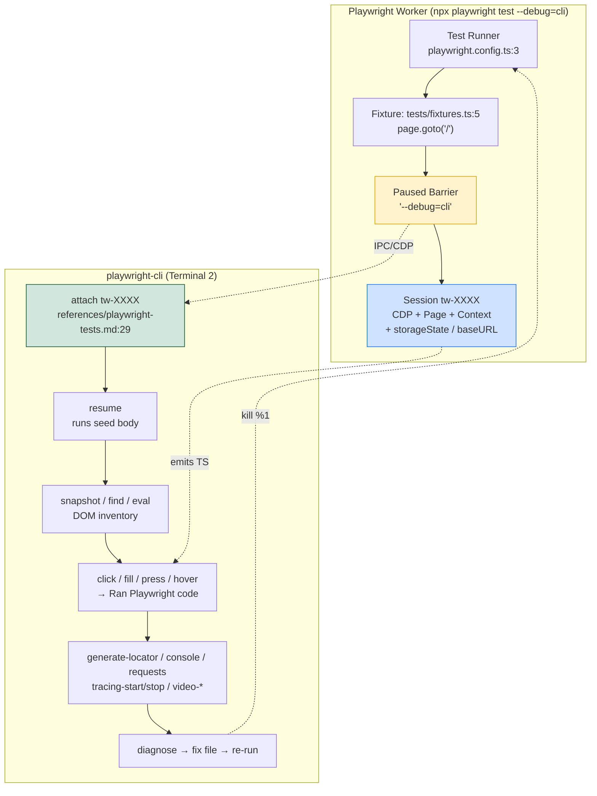

# `npx playwright test --debug=cli` — Complete Guide

> **Project:** `playwright-cli-demo` — Playwright + `playwright-cli` for https://www.demoblaze.com  
> **Seed:** `tests/seed.spec.ts:5` · **Fixture:** `tests/fixtures.ts:4` · **Config:** `playwright.config.ts:11` (`baseURL: https://www.demoblaze.com`)  
> **Generated:** 2026-08-31 · **Playwright:** `^1.62.1` · **`@mermaid-js/mermaid-cli`:** `^11.16.0`

---

## Table of Contents

1. [What `--debug=cli` actually does](#1-what---debugcli-actually-does)
2. [Architecture: the `tw-XXXX` session](#2-architecture-the-tw-xxxx-session)
3. [Why `--debug=cli` beats `playwright-cli open <url>`](#3-why---debugcli-beats-playwright-cli-open-url)
4. [Command Inventory (attach / resume / snapshot / find / locator / eval / console / requests / run-code / tracing / video)](#4-command-inventory)
5. [Live Healing Workflow](#5-live-healing-workflow)
6. [Comparison: Debug vs Trace vs Video](#6-comparison-debug-vs-trace-vs-video)
7. [Recipe 1 — Exploration from Seed](#7-recipe-1--exploration-from-seed)
8. [Recipe 2 — Generate a New Test Case](#8-recipe-2--generate-a-new-test-case)
9. [Recipe 3 — Heal a Failing Locator](#9-recipe-3--heal-a-failing-locator)
10. [Tips, Pitfalls, and Cleanup](#10-tips-pitfalls-and-cleanup)
11. [Appendix: File Map & References](#11-appendix-file-map--references)

---

## 1. What `--debug=cli` actually does

### Normal `npx playwright test`

```
PLAYWRIGHT_HTML_OPEN=never npx playwright test
```

- Playwright discovers tests under `testDir: ./tests` (`playwright.config.ts:4`).
- Each worker launches a browser, runs fixtures (`tests/fixtures.ts:5` does `await page.goto('/')`), executes the test body, tears down.
- No interactive pause. Failures surface as stack traces + optional trace/screenshot (`playwright.config.ts:12-13`).

### Debug CLI mode

```
PLAYWRIGHT_HTML_OPEN=never npx playwright test --debug=cli
```

What changes (see `.opencode/skills/playwright-cli/references/playwright-tests.md:16-32`):

1. **Pauses at start** — the runner prints `Debugging Instructions` with a session name like `tw-a3f9c1` and blocks.
2. **Exposes a `playwright-cli`-addressable browser** — the same `page`/`context` the test will use. You drive it via `playwright-cli attach tw-XXXX`.
3. **Every CLI action emits Playwright TypeScript** — `Ran Playwright code: await page.getByRole(...)` appears in stdout; copy-paste directly into `tests/**/*.spec.ts`.
4. **Runs inside the test's fixture chain** — `storageState`, auth, `baseURL`, custom fixtures (`tests/fixtures.ts:5`) are already applied. No re-implementation.
5. **Lifecycle is explicit** — you `resume` to let the seed run, then interleave exploration, then stop the background job (`kill %1` / Ctrl+C) and re-run to confirm green.

```
┌─────────────────────────────────────────────────────────────────┐
│  Terminal 1 (background)                                        │
│  $ PLAYWRIGHT_HTML_OPEN=never npx playwright test --debug=cli   │
│  Debugging Instructions:                                         │
│    playwright-cli attach tw-9c12                                │
│  ── paused, waiting for attach ──                                │
│                                                                 │
│  Terminal 2 (foreground)                                        │
│  $ playwright-cli attach tw-9c12                                │
│  $ playwright-cli resume        # seed runs (fixtures → goto /) │
│  $ playwright-cli snapshot      # inventory                      │
│  $ playwright-cli click e5      # → emits TS                    │
└─────────────────────────────────────────────────────────────────┘
```

> Set `PLAYWRIGHT_HTML_OPEN=never` on every `npx playwright test` invocation so CI/reporters don't block waiting for input — this repo's `playwright.config.ts:9` already sets `open: 'never'` for the HTML reporter.

---

## 2. Architecture: the `tw-XXXX` session

`tw-XXXX` is an ephemeral browser session owned by the Playwright test worker. The CLI is a thin client.



**Rendered:** `debug-cli-architecture.png` (1600×scale-2 via `mmdc`).

Key mechanics (grounded in `.opencode/skills/playwright-cli/SKILL.md` and `references/test-generation.md:204-221`):

| Step | Command | What happens on `tw-XXXX` |
|------|---------|---------------------------|
| 1 | `npx playwright test --debug=cli &` | Worker starts, fixtures not yet executed, port/session file written |
| 2 | `playwright-cli attach tw-XXXX` | CLI connects over CDP/IPC; subsequent commands target this `page` |
| 3 | `playwright-cli resume` | Barrier lifted; `tests/seed.spec.ts:5` runs (fixture does `goto('/')`), page lands at `https://www.demoblaze.com` |
| 4 | `playwright-cli snapshot` | Accessibility tree dumped to `.playwright-cli/page-*.yml`; refs `e1..eN` assigned |
| 5 | `playwright-cli click e5` etc. | Action dispatched, DOM + network observed, TS emitted |

Session naming: `tw-` + 6 hex chars (e.g., `tw-9c12ab`). Ephemeral — new run ⇒ new name. The name appears only after `Debugging Instructions` is printed; scripts must poll/wait (see `DEBUG_CLI_DEMO.sh:22-35`).

---

## 3. Why `--debug=cli` beats `playwright-cli open <url>`

`playwright-cli open https://www.demoblaze.com` creates a **standalone** browser with no test context. `--debug=cli` runs **inside** the test harness.

| Concern | `playwright-cli open <url>` | `npx playwright test --debug=cli` + `attach` |
|---------|-----------------------------|----------------------------------------------|
| `baseURL` (`playwright.config.ts:11`) | Must hard-code URL | Inherited — `tests/fixtures.ts:5` already did `goto('/')` |
| Fixtures / POMs | Not executed | Executed: `HomePage` (`pages/HomePage.ts:20`), `CartPage` (`pages/CartPage.ts:11`), `Modals` (`pages/Modals.ts:101`) reuse applies |
| `storageState` / auth / cookies | Manual `state-load` | Already loaded from project config |
| Target fidelity | Explores prod URL, may miss fixture side-effects (seeding cart, clearing storage) | Identical to what the failing test sees |
| locator drift repro | May click a different DOM if fixture mutates page | Repro is exact — same page object the assertion will run against |
| Generated code quality | Same emitter, but locators may differ without fixture context | Locators match the real test's `page` instance |
| Recommendation | Quick ad-hoc peek | **Plan → Generate → Heal** (`references/test-generation.md:10-11`) |

> Rule from `references/test-generation.md:212,232,301`: *Do not just open the app URL with `playwright-cli`; always go through the seed.* This captures auth, baseURL, and fixture navigation that `open` would miss.

---

## 4. Command Inventory

All commands below assume `playwright-cli attach tw-XXXX` has succeeded (see `.opencode/skills/playwright-cli/SKILL.md:26-187` for full catalog).

### Session

```bash
PLAYWRIGHT_HTML_OPEN=never npx playwright test tests/seed.spec.ts --debug=cli &
# wait for "Debugging Instructions" → tw-XXXX
playwright-cli attach tw-XXXX
playwright-cli resume            # let tests/seed.spec.ts:5 run
playwright-cli snapshot          # full a11y tree → refs e1..eN
```

### Discovery — `snapshot` / `find`

```bash
playwright-cli snapshot                          # → .playwright-cli/page-*.yml
playwright-cli snapshot --depth=4                # limit depth
playwright-cli snapshot e12                      # scope to element
playwright-cli snapshot --boxes                  # include [box=x,y,w,h]
playwright-cli find "Add to cart"                # grep snapshot (3 lines context)
playwright-cli find --regex "/add to cart/i"
playwright-cli find --regex "\\$[0-9]+\\.[0-9]{2}"
```

### Interaction — `click` / `fill` / `press` / `hover` / `drag` / `select`

```bash
playwright-cli click e5
playwright-cli fill e3 "Test User" --submit      # --submit presses Enter after fill
playwright-cli press Enter
playwright-cli hover e4
playwright-cli select e9 "USA"
playwright-cli check e12
playwright-cli drag e2 e8
```

Each emits (example from `tests/cart/add-single-product-to-cart.spec.ts:15`):

```
Ran Playwright code:
await page.getByRole('link', { name: 'Samsung galaxy s6', exact: true }).click();
```

### Locators & Evaluation — `generate-locator` / `eval` / `highlight`

```bash
playwright-cli --raw generate-locator e5
# → getByRole('button', { name: 'Purchase' })

playwright-cli --raw eval "el => el.textContent" e5
playwright-cli --raw eval "el => el.value" e5
playwright-cli eval "location.href"               # no ref → evaluates on window
playwright-cli eval "document.title"
playwright-cli highlight e5 --style="outline: 3px dashed red"
playwright-cli highlight e5 --hide
```

Pattern for assertions (`references/test-generation.md:82-113`):

```bash
playwright-cli --raw generate-locator e7   # locator for expect()
playwright-cli --raw eval "el => el.textContent" e7   # expected value for toHaveText
playwright-cli --raw snapshot e7           # aria snapshot for toMatchAriaSnapshot
```

### DevTools — `console` / `requests` / `request` / `run-code`

```bash
playwright-cli console                 # all console messages
playwright-cli console warning         # filtered
playwright-cli requests                # network log table
playwright-cli request 5               # detail for request #5 (headers/body/timing)
playwright-cli run-code "async page => await page.context().grantPermissions(['geolocation'])"
playwright-cli run-code --filename=script.js
```

### Tracing — `tracing-start` / `tracing-stop`

See `references/tracing.md:7-18` and `debug-cli-trace-example.md`.

```bash
playwright-cli tracing-start
playwright-cli click e5
playwright-cli fill e7 "test"
playwright-cli tracing-stop
# outputs: traces/trace-<timestamp>.trace + .network + resources/
```

### Video — `video-start` / `video-chapter` / `video-stop`

See `references/video-recording.md:11-28`.

```bash
playwright-cli video-start demo.webm
playwright-cli video-chapter "Checkout" --description="Placing an order" --duration=2000
playwright-cli video-stop
playwright-cli video-show-actions --duration=600 --position=top-right
```

### Storage — `state-save` / `cookie-*` / `localstorage-*` / `sessionstorage-*`

```bash
playwright-cli state-save auth.json
playwright-cli cookie-list
playwright-cli localstorage-list
playwright-cli localstorage-get theme
```

---

## 5. Live Healing Workflow

When a test fails, `references/test-generation.md:367-423` prescribes healing inside `--debug=cli`:

```mermaid
sequenceDiagram
    actor Dev as Developer / Agent
    participant Runner as npx playwright test --debug=cli
    participant CLI as playwright-cli (attach tw-XXXX)
    participant App as Demoblaze (page)
    participant FS as File System

    Dev->>Runner: PLAYWRIGHT_HTML_OPEN=never npx playwright test tests/cart/add-single-product-to-cart.spec.ts:9 --debug=cli &
    Runner-->>Dev: Debugging Instructions: playwright-cli attach tw-9c12 (paused)
    Dev->>CLI: playwright-cli attach tw-9c12
    Dev->>CLI: playwright-cli resume
    CLI->>App: resume seed (tests/fixtures.ts:6 goto /) → Home loaded
    Dev->>CLI: playwright-cli snapshot
    CLI-->>Dev: yml with refs e1..eN
    Dev->>CLI: playwright-cli click e12  (rehearse fix)
    CLI->>App: click dispatched
    CLI-->>Dev: Ran Playwright code: await page.getByRole('link', {name:'Samsung galaxy s6'}).click()
    Dev->>CLI: playwright-cli console / requests  (diagnose)
    CLI-->>Dev: no app error; 200s OK
    Dev->>CLI: playwright-cli --raw generate-locator e12
    CLI-->>Dev: getByRole('link', {name:'Samsung galaxy s6', exact:true})
    Dev->>FS: edit tests/cart/add-single-product-to-cart.spec.ts:15 (update locator)
    Dev->>Runner: kill %1 (stop debug)
    Dev->>Runner: PLAYWRIGHT_HTML_OPEN=never npx playwright test tests/cart/add-single-product-to-cart.spec.ts
    Runner-->>Dev: 1 passed
    Dev->>FS: if user-visible behavior changed, update specs/demoblaze.plan.md:65 (reconcile)
```

**Rendered:** `debug-cli-heal-flow.png`.

**Healing checklist:**

1. `PLAYWRIGHT_HTML_OPEN=never npx playwright test <file>:<line> --debug=cli &` — note `tw-XXXX`.
2. `playwright-cli attach tw-XXXX` → `resume` → `snapshot`.
3. `console` / `requests` / `find` to classify failure (selector drift, timing, app bug).
4. `generate-locator` + `eval` to craft the replacement assertion/locator.
5. Edit the spec file, `kill %1`, re-run single test, then full suite.

---

## 6. Comparison: Debug vs Trace vs Video

| Feature | `--debug=cli` (interactive) | Trace (`tracing-start/stop`) | Video (`video-start/stop`) |
|---------|-----------------------------|------------------------------|----------------------------|
| **Format** | Live CDP session `tw-XXXX` | `.trace` + `.network` + `resources/` (`references/tracing.md:22-48`) | `.webm` VP8/VP9 (`references/video-recording.md:3`) |
| **DOM inspection** | Yes — `snapshot`/`find`/`eval` live | Yes — snapshots before/after each action | No |
| **Network details** | Yes — `requests`/`request N` live | Yes — full HAR-like `.network` | No |
| **Console** | Yes — `console` live | Yes — captured in `.trace` | No |
| **Replay** | Step-through via CLI; resume/pause | Trace Viewer (`npx playwright show-trace`) | Continuous playback |
| **Interactivity** | Full — `click`/`fill`/`run-code` | Post-hoc only | Post-hoc only |
| **File size** | Tiny (session only) | Medium | Large |
| **Best for** | Exploration, generation, healing | Post-mortem of failures, perf waterfall | Demos, stakeholder evidence |
| **Composability** | Can start `tracing-start` / `video-start` *inside* a debug session | Can record while debugging — `tracing-start` then actions then `tracing-stop` | Same — `video-start` inside debug |
| **When to choose** | Active authoring / fixing | Need step-by-step replay after CI failure | Need visual proof / chapter cards |

> Tip: Start both tracing and video inside the same `tw-XXXX` session before reproducing a flaky failure — you get interactive diagnosis *and* durable artifacts.

---

## 7. Recipe 1 — Exploration from Seed

**Goal:** Map catalog navigation before writing `specs/demoblaze.plan.md:9-59`.

```bash
# 1. Launch via seed — captures baseURL + fixtures
PLAYWRIGHT_HTML_OPEN=never npx playwright test tests/seed.spec.ts --debug=cli &
# wait for: Debugging Instructions: playwright-cli attach tw-XXXX
playwright-cli attach tw-XXXX

# 2. Let the seed run — lands at https://www.demoblaze.com via tests/fixtures.ts:6
playwright-cli resume

# 3. Inventory the page
playwright-cli snapshot
# → e.g. [link "Phones" exact], [link "Laptops"], [link "Samsung galaxy s6"], [button "Next"]

# 4. Follow a flow, collecting emitted TS
playwright-cli click e12   # Phones — Ran: await page.getByRole('link', {name:'Phones',exact:true}).click()
playwright-cli snapshot    # verify grid filtered — Samsung galaxy s6, Nokia lumia 1520 remain
playwright-cli find "Samsung galaxy s6"
# Ran: expect(page.getByRole('link', {name:'Samsung galaxy s6'})).toBeVisible()  ← adapt for assertion

# 5. Probe state
playwright-cli eval "location.href"
playwright-cli eval "el => el.textContent" e15   # read price heading
playwright-cli console              # no errors expected
playwright-cli requests             # confirm no failed fetches

# 6. Reach product detail
playwright-cli click e20  # Samsung galaxy s6
playwright-cli snapshot   # confirm h2 Samsung galaxy s6, h3 $360, link Add to cart

# 7. Clean up (important: references/test-generation.md:232-233)
playwright-cli close   # or kill %1; then
kill %1
wait %1 2>/dev/null || true
```

What you now know: category links are `pages/HomePage.ts:30-32` (`getByRole('link', {name:'Phones',exact:true})`), product links `pages/HomePage.ts:51`, carousel buttons `pages/HomePage.ts:33-34`. This maps directly to the plan's `filter-by-phone-category` scenario.

---

## 8. Recipe 2 — Generate a New Test Case

**Goal:** Generate `tests/catalog/navigate-to-product-details.spec.ts` for spec `1.3` (`specs/demoblaze.plan.md:36-47`).

```bash
# 1. Start from seed — fresh page per scenario (references/test-generation.md:294-298)
PLAYWRIGHT_HTML_OPEN=never npx playwright test tests/seed.spec.ts --debug=cli &
playwright-cli attach tw-XXXX
playwright-cli resume
playwright-cli snapshot

# 2. Walk Steps one-by-one, spec is the plan, live app is source of truth
# Step 1: Click Samsung galaxy s6
playwright-cli click e18
# → await page.getByRole('link', { name: 'Samsung galaxy s6', exact: true }).click();
playwright-cli eval "location.href"
# → https://www.demoblaze.com/prod.html?idp_=1

# 3. Capture expectations for the step (references/test-generation.md:92-113)
playwright-cli --raw generate-locator e22   # price heading
# → getByRole('heading', { name: '$360 *includes tax' })
playwright-cli --raw eval "el => el.textContent" e22
# → "$360 *includes tax"
playwright-cli --raw snapshot e25           # description paragraph
# → for toMatchAriaSnapshot

# 4. Step 2: go Home / back
playwright-cli click e5   # Home — pages/HomePage.ts:23
# → await page.getByRole('link', { name: 'Home' }).click();

# 5. Stop session before next scenario (references/test-generation.md:348)
playwright-cli close
kill %1; wait %1 2>/dev/null || true
```

**Resulting file** (`tests/catalog/navigate-to-product-details.spec.ts`):

```ts
// spec: specs/demoblaze.plan.md
// seed: tests/seed.spec.ts
import { test, expect } from '../fixtures';
import { HomePage } from '../../pages/HomePage';

test.describe('Catalog and Navigation', () => {
  test('navigate-to-product-details', async ({ page }) => {
    const home = new HomePage(page);
    // 1. Click link "Samsung galaxy s6" on homepage
    await home.openProduct('Samsung galaxy s6');
    await expect(page).toHaveURL(/.*prod\.html\?idp_=1/);
    await expect(page.getByRole('heading', { name: 'Samsung galaxy s6', level: 2 })).toBeVisible();
    await expect(page.getByRole('heading', { name: '$360 *includes tax' })).toBeVisible();
    await expect(page.getByRole('link', { name: 'Add to cart' })).toBeVisible();
    // 2. Click link "Home" or browser back
    await home.goHome();
    await expect(page.getByText('CATEGORIES')).toBeVisible();
  });
});
```

Rules enforced: one test per file, `// N. <step text>` comments, `describe` name verbatim from spec, import from `../fixtures` when present (`references/test-generation.md:342-348`).

---

## 9. Recipe 3 — Heal a Failing Locator

**Scenario:** `filter-by-phone-category` started failing — `await home.productPrice('$360')` strict-mode violation or hidden element. True example from this repo: `CartPage.ts:49` uses `toHaveText` with exact heading; a wrapper div added around price breaks `getByRole('heading', {name:'$360'})`.

### 9.1 Find the failure

```bash
PLAYWRIGHT_HTML_OPEN=never npx playwright test --reporter=list 2>&1 | grep -E "FAIL|Error"
# e.g. tests/catalog/filter-by-phone-category.spec.ts:17:5 — heading "$360" not found
```

### 9.2 Reproduce inside `--debug=cli`

```bash
PLAYWRIGHT_HTML_OPEN=never npx playwright test tests/catalog/filter-by-phone-category.spec.ts:7 --debug=cli &
playwright-cli attach tw-XXXX
playwright-cli resume     # seed runs, then test body pauses at failure point if using --debug=cli on specific line
# Instead, manually replay:
playwright-cli snapshot
playwright-cli find "\\$360"
# → reveals heading now nested: [heading "$360 *includes tax"] or [text "$360"] inside div
```

### 9.3 Diagnose

```bash
playwright-cli console          # check for app-side errors — none expected here
playwright-cli requests         # confirm 200s — catalog is client-side filtered, no fetch
playwright-cli snapshot --boxes # bounding box reveals visibility
playwright-cli eval "el => getComputedStyle(el).display" e14
playwright-cli eval "el => el.outerHTML.slice(0,300)" e14
```

### 9.4 Craft the fix

```bash
playwright-cli --raw generate-locator e14
# before: getByRole('heading', { name: '$360' })
# after:  getByRole('heading', { name: '$360 *includes tax' })  or  getByText('$360')
playwright-cli --raw eval "el => el.textContent" e14
# → "$360 *includes tax"
```

**Healed test** (`tests/catalog/filter-by-phone-category.spec.ts:17`):

```ts
// before (broken):
await expect(home.productPrice('$360')).toBeVisible();

// after (healed — matches pages/HomePage.ts:54 semantics, or re-scope):
await expect(page.getByRole('heading', { name: '$360 *includes tax' })).toBeVisible();
// or tolerance:
await expect(page.getByText('$360')).toBeVisible();
```

### 9.5 Verify & reconcile

```bash
kill %1; wait %1 2>/dev/null || true
PLAYWRIGHT_HTML_OPEN=never npx playwright test tests/catalog/filter-by-phone-category.spec.ts
# → 1 passed

# Reconcile with spec (references/test-generation.md:408-418):
# - Fix was technical (locator drift) → leave specs/demoblaze.plan.md unchanged.
# - If fix changed user-visible behavior → update spec Steps/expect lines.
# - If unclear whether app change is intentional → ask user with scenario id + snapshot excerpt.
```

Dialog race healing (existing fix `tests/cart/add-single-product-to-cart.spec.ts:21-25`):

```ts
// fragile:
await product.addToCartLink.click(); // alert races

// healed:
const dialogPromise = page.waitForEvent('dialog');
await product.addToCartLink.click();
const dialog = await dialogPromise;
expect(dialog.message()).toBe('Product added');
await dialog.accept();
```

Rehearse the healed sequence via CLI: `playwright-cli run-code` to inject `waitForEvent` before `click`, or manually interleave in `DEBUG_CLI_DEMO.sh`.

---

## 10. Tips, Pitfalls, and Cleanup

- **Always `PLAYWRIGHT_HTML_OPEN=never`** — prevents the HTML reporter from blocking CI.
- **Poll for `tw-XXXX`** — `DEBUG_CLI_DEMO.sh:22-35` shows a robust wait loop; don't assume instant readiness (Playwright needs ~2-5 s to boot Chromium).
- **One scenario at a time** — `references/test-generation.md:352` warns parallel generation is fragile; restart the seed between scenarios.
- **No `networkidle`, no sleeps** — `references/test-generation.md:405` forbids `networkidle` and `sleep`-based fixes; use `toBeVisible` / `toHaveText` with auto-waiting.
- **Strict violations** — if `getByRole` matches >1 element, add `{ exact: true }` (as `pages/HomePage.ts:24-28` does) or narrow with `locator.filter({hasText})`.
- **Alert handling** — Demoblaze uses native `alert()` for add-to-cart, contact, and order validation. Always `page.waitForEvent('dialog')` *before* the triggering click.
- **Storage persistence** — cart survives reload via `localStorage` (`tests/cart/cart-persistence-after-reload.spec.ts:99`). Use `playwright-cli localstorage-list` / `reload` to inspect.
- **Cleanup** — always `playwright-cli close` + `kill %1` after a debug session; leaked workers hold ports and lock `test-results/`.

```bash
# Safe teardown idiom (used in DEBUG_CLI_DEMO.sh:88-95)
playwright-cli close 2>/dev/null || true
kill %1 2>/dev/null || true
wait %1 2>/dev/null || true
playwright-cli close-all 2>/dev/null || true
```

---

## 11. Appendix: File Map & References

| File | Lines | Role |
|------|-------|------|
| `playwright.config.ts:3-23` | 23 | `testDir`, `baseURL`, `trace`, `projects` |
| `tests/fixtures.ts:4-8` | 9 | Extends `page` to `goto('/')` automatically |
| `tests/seed.spec.ts:5` | 7 | Seed — empty body, fixture does navigation |
| `pages/HomePage.ts:20-35` | 86 | Brand/home/cart/auth/category/carousel locators |
| `pages/ProductPage.ts:15` | 37 | `addToCartLink`, `productTitle` (h2) |
| `pages/CartPage.ts:12-14` | 56 | `#tbodyid`, `#totalp`, `Place Order` |
| `pages/Modals.ts:101-162` | 162 | `PlaceOrderModal` (6 inputs + success) |
| `specs/demoblaze.plan.md:1-207` | 207 | 15 scenarios across 5 groups |
| `tests/cart/add-single-product-to-cart.spec.ts:21-25` | 38 | Dialog race healed pattern |
| `tests/checkout/place-order-success-flow.spec.ts:44-51` | 70 | `fillOrder` + `expectSuccessVisible` |
| `.opencode/skills/playwright-cli/SKILL.md:26-187` | 419 | Full CLI command reference |
| `.opencode/skills/playwright-cli/references/playwright-tests.md:16-32` | 39 | `--debug=cli` attach mechanics |
| `.opencode/skills/playwright-cli/references/test-generation.md:10-423` | 433 | Plan → Generate → Heal workflow |
| `.opencode/skills/playwright-cli/references/tracing.md:7-48` | 139 | `tracing-start/stop` + output files |
| `.opencode/skills/playwright-cli/references/video-recording.md:11-28` | 143 | `video-start/chapter/stop` |
| `DEBUG_CLI_DEMO.sh` | ~120 | Executable lifecycle demo |
| `DEBUG_CLI_CHEATSHEET.md` | ~80 | One-page copy-paste reference |
| `debug-cli-trace-example.md` | ~120 | `tracing-*` + `console` + `requests` deep-dive |
| `debug-cli-architecture.png` | — | Architecture flowchart (mmdc 1600×2) |
| `debug-cli-heal-flow.png` | — | Healing sequence diagram (mmdc 1600×2) |
| `debug-cli-lifecycle.png` | — | Lifecycle state machine (mmdc 1600×2) |

**Skill discovery:** `find-skills` run for `diagram mermaid pdf`, `playwright`, `video tracing` found `microsoft/playwright-cli@playwright-cli` (137.4K installs) already installed locally; diagram/video skills were low-install (<110) so fallback to `mermaid-cli@11.16.0` + `md-to-pdf@5.2.5` per instructions.

---

*End of guide — see `DEBUG_CLI_CHEATSHEET.md` for the one-pager, `DEBUG_CLI_DEMO.sh` for the runnable lifecycle, and `debug-cli-trace-example.md` for tracing deep-dive.*
