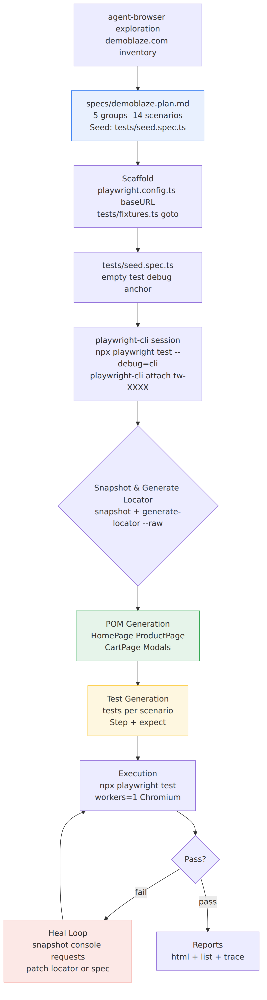
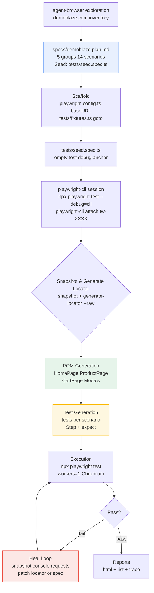
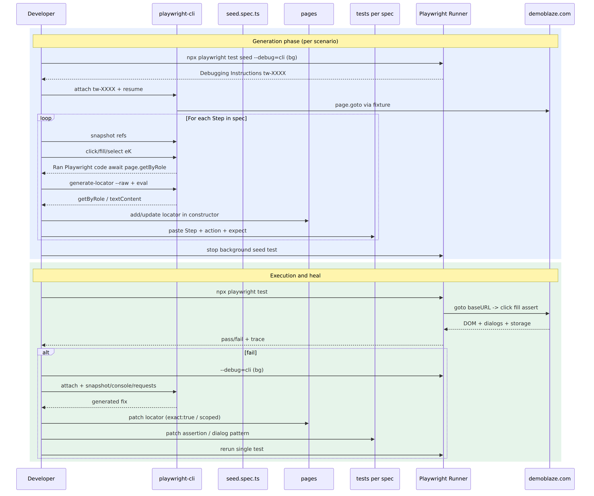
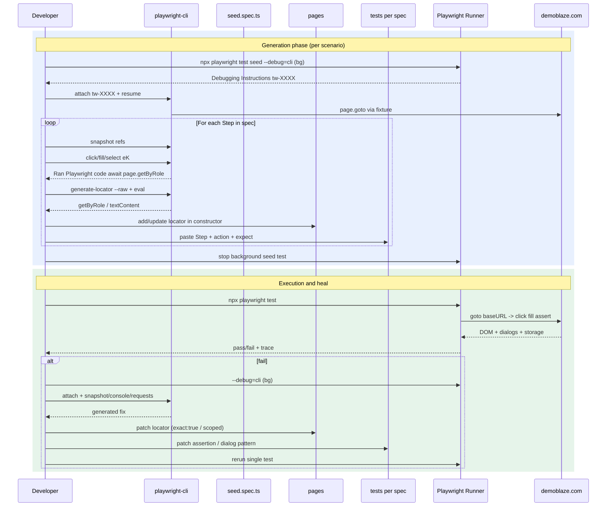

# Demoblaze Playwright Automation — High Level Design (HLD)

**Project:** `playwright-cli-demo` | **App under test:** https://www.demoblaze.com  
**Date:** 2026-08-31 | **Playwright:** ^1.62.1 | **Base URL:** `https://www.demoblaze.com`  
**Spec source:** `specs/demoblaze.plan.md` | **Seed:** `tests/seed.spec.ts`  
**Author:** OpenCode (Muse Spark) — generated via repo-artifact inspection

---

## Executive Summary (1-Page)

Demoblaze is a demo e-commerce SPA (Phones / Laptops / Monitors) exercised through **14 scenarios in 5 groups** (spec enumerates 13; repo implements 14 — see §5). Tests were authored with the **playwright-cli code-generation loop** (`npx playwright test --debug=cli` → `playwright-cli attach tw-XXXX` → `snapshot` → `generate-locator` → action-to-TS emission) layered on top of a **Page Object Model (POM)** + **fixture-driven scaffold**.

**How it works:** `agent-browser` explores demoblaze.com to inventory surfaces (category sidebar, carousel, product grid, cart table `#tbodyid`, checkout `#orderModal`, auth modals `#signInModal`/`#logInModal`, contact `#exampleModal`, video `#videoModal`, native `alert()` dialogs). Findings are distilled into `specs/demoblaze.plan.md` — one file per scenario, `// 1. Step` comments, `- expect:` bullets → `expect()` — seeded from `tests/seed.spec.ts` which relies on `tests/fixtures.ts` to `page.goto('/')` before every test. `playwright-cli` then replays each scenario step live, emitting semantic locators (`getByRole(..., {exact:true})`, `locator('#id')`) that are collected into four POM classes (`HomePage`, `ProductPage`, `CartPage`, `Modals.*`) and 14 `tests/**/*.spec.ts` files (`test.describe` per group, one `test()` per file). Execution is single-worker, no retries, `trace: on-first-retry`; the heal loop fixes strict-mode violations, dialog timing, and cart async rendering.

**Outcome:** 15 test files (14 scenario + 1 seed), 4 POMs (total ~341 LOC), 1 fixture, HTML+list reporters, deterministic local run via `PLAYWRIGHT_HTML_OPEN=never npx playwright test`. Mermaid sources are embedded below and rendered to `HLD-architecture.png` / `HLD-sequence.png`; this markdown exports to `HLD.pdf`.

---

## Table of Contents

1. Introduction
2. Architecture Overview & Component Table
3. Detailed Design
   - 3.1 Agent-Browser Exploration
   - 3.2 Spec Generation (`demoblaze.plan.md` & Seed Concept)
   - 3.3 Scaffold (Config, Fixtures, Seed)
   - 3.4 POM Generation
   - 3.5 Test Generation (playwright-cli mechanics)
   - 3.6 Execution & Heal Loop
4. Data Flow & Diagrams
5. File Tree & Scenario→File Mapping
6. Locator Strategy, Dialog & Timing Patterns
7. Execution Model
8. Generation & Heal Lessons
9. References

---

## 1. Introduction

### 1.1 Purpose

Explain how 13–14 demoblaze Test Cases (TCs) from `specs/demoblaze.plan.md:1` were executed via Playwright using `playwright-cli` by generating POMs, fixtures, and `*.spec.ts` files — so a new engineer can reproduce the flow end-to-end.

### 1.2 Scope

Covers demoblaze.com Store front-end only (no backend API). Out of scope: payment gateway integration, multi-browser matrix, visual regression.

### 1.3 Application Overview

Demoblaze (`specs/demoblaze.plan.md:5`) sells 3 categories. Key surfaces: navbar (`PRODUCT STORE`, `Home`, `Contact`, `About us`, `Cart`, `Log in`, `Sign up`), category sidebar (`CATEGORIES` + `Phones`/`Laptops`/`Monitors`), carousel (`#carouselExampleIndicators`, `First/Second/Third slide`), product grid (`#tbodyid`, links like `Samsung galaxy s6`, headings `$360`), product page (`prod.html?idp_=N`, `h2` title, `h3.price-container`, `Add to cart`), cart (`cart.html`, `#tbodyid tr`, `#totalp`, `Place Order`), checkout order modal (`#orderModal`, `Total: N`, inputs `#name #country #city #card #month #year`, `Purchase`/`Close`, `.sweet-alert` success), auth modals (`#signInModal`/`#logInModal`, `#sign-username`/`#loginusername`), contact (`#exampleModal`, `#recipient-email`), about (`#videoModal`, `Play Video`), native `alert()` (`Product added`, `Please fill out Username and Password.`, `Thanks for the message!!`, `Please fill out Name and Creditcard.`).

### 1.4 Tech Stack

| Layer | Choice | Why |
|---|---|---|
| Runner | `@playwright/test ^1.62.1` | First-class fixtures, trace, web-first assertions |
| Browser | Chromium (Desktop Chrome) | Single deterministic project; `playwright.config.ts:18` |
| Codegen | `playwright-cli` (`@playwright/cli@0.1.18`) | Snapshot→locator→TS emission, `--debug=cli` attach |
| Exploration | `agent-browser` MCP | Interactive inventory before spec authoring |
| Language | TypeScript | POM type safety (`Page`, `Locator`) |
| Reports | `html` + `list` | Local debugging + CI-friendly |

---

## 2. Architecture Overview & Component Table

### 2.1 Logical Architecture

```
┌─────────────────────────────────────────────────────────────────────┐
│                        Authoring Plane (offline)                     │
│  agent-browser ──► specs/demoblaze.plan.md ──► playwright-cli       │
│  (explore)          (14 scenarios, Seed concept)   (snapshot/attach)│
└──────────────────────────────┬──────────────────────────────────────┘
                               │  npx playwright test --debug=cli
                               ▼
┌─────────────────────────────────────────────────────────────────────┐
│                        Generation Plane                              │
│  tests/fixtures.ts ──► tests/seed.spec.ts ──► pages/*.ts (POM)     │
│  tests/**/*.spec.ts (one file per scenario, test.describe)          │
│  playwright.config.ts (baseURL, workers=1, trace)                   │
└──────────────────────────────┬──────────────────────────────────────┘
                               │  npx playwright test
                               ▼
┌─────────────────────────────────────────────────────────────────────┐
│                        Execution Plane                               │
│  Playwright Test Runner ──► https://www.demoblaze.com               │
│  locators (getByRole exact)  dialogs (waitForEvent)  cart (#tbodyid)│
│  Heal loop ──► snapshot/console/requests ──► patch spec & test     │
└─────────────────────────────────────────────────────────────────────┘
```

### 2.2 Component Table

| Component | Path | Responsibility | Key API / Notes |
|---|---|---|---|
| **Config** | `playwright.config.ts:1` | Test dir, baseURL, timeouts, single Chromium project | `defineConfig({ testDir:'./tests', workers:1, fullyParallel:false, retries:0, use:{ baseURL:'https://www.demoblaze.com', actionTimeout:10000, navigationTimeout:15000, trace:'on-first-retry' } })` |
| **Fixture** | `tests/fixtures.ts:1` | Fresh navigation per test; re-export `expect` | `baseTest.extend({ page: async ({page}, use)=>{ await page.goto('/'); await use(page);} })` — `tests/fixtures.ts:5` |
| **Seed** | `tests/seed.spec.ts:1` | Canonical fresh-state entry; `--debug=cli` anchor | Empty `test('seed')` body; comment `// spec: specs/demoblaze.plan.md` `tests/seed.spec.ts:1` |
| **HomePage POM** | `pages/HomePage.ts:1` | Navbar, categories, carousel, product grid | `brandLink getByRole('link', PRODUCT STORE)` `pages/HomePage.ts:22`; `filterByCategory()` `pages/HomePage.ts:42`; `productLink(name)` `pages/HomePage.ts:50`; `productPrice(price)` `pages/HomePage.ts:54`; `carousel*Button` `pages/HomePage.ts:33` |
| **ProductPage POM** | `pages/ProductPage.ts:1` | Product detail + Add-to-cart dialog | `h2`, `h3.price-container`, `#more-information`, `getByRole('link','Add to cart')` `pages/ProductPage.ts:12`; `addToCartAndAcceptAlert()` with `waitForEvent('dialog')` `pages/ProductPage.ts:24` |
| **CartPage POM** | `pages/CartPage.ts:1` | Cart table & total | `#tbodyid`, `#totalp`, `getByRole('button','Place Order')`, `productRow(name)` `pages/CartPage.ts:27`; `expectTotalEmpty()` `pages/CartPage.ts:52` |
| **AuthModals** | `pages/Modals.ts:3` | Sign up / Log in | `#signInModal`, `#logInModal`, `#sign-username`, `#loginusername`, `.close` fallback `pages/Modals.ts:46` |
| **ContactModal** | `pages/Modals.ts:59` | Contact form | `#exampleModal`, `#recipient-email`, `#recipient-name`, `#message-text`, `Send message` |
| **AboutUsModal** | `pages/Modals.ts:83` | Video modal | `#videoModal`, `Play Video`, `Close` scoped |
| **PlaceOrderModal** | `pages/Modals.ts:101` | Checkout + success | `#orderModal`, `#name #country #city #card #month #year`, `Purchase`, `.sweet-alert`, `fillOrder()` `pages/Modals.ts:146`, `expectSuccessVisible()` `pages/Modals.ts:155` |
| **Catalog tests** | `tests/catalog/*.spec.ts` | 4 tests — filter Phones/Laptops, product nav, carousel | `test.describe('Catalog and Navigation')` pattern |
| **Cart tests** | `tests/cart/*.spec.ts` | 3 tests — add, remove, persistence | `waitForEvent('dialog')` + `page.reload()` for persistence |
| **Auth tests** | `tests/auth/*.spec.ts` | 3 tests — signup/login validation, open/close | `page.once('dialog', ...)` for validation alerts |
| **Misc tests** | `tests/misc/*.spec.ts` | 2 tests — contact, about video | `toHaveValue` + `toBeHidden` with 5s timeout |
| **Checkout tests** | `tests/checkout/*.spec.ts` | 2 tests — success + missing-field validation | `fillOrder()`, `expectSuccessVisible({amount,card,name})` |
| **Spec** | `specs/demoblaze.plan.md:1` | Single source of truth for 14 scenarios | `**Seed:**` + `**File:**` + numbered `Steps:` with `- expect:` bullets |
| **playwright-cli** | `.opencode/skills/playwright-cli/` | Codegen reference + session mechanics | `references/test-generation.md:1` |

---

## 3. Detailed Design

### 3.1 Agent-Browser Exploration → Spec Generation

**Goal:** inventory interactive surfaces *before* writing the spec, so the plan matches reality.

**Tool:** `agent-browser` (MCP browser automation) per task context; interchangeable with `playwright-cli open`/`snapshot` per skill docs.

**Exploration checklist (applied to demoblaze):**

| Surface | Probe | Observation captured in spec |
|---|---|---|
| Navbar | `snapshot` roles `link`/`button` | `Home`, `Contact`, `About us`, `Cart`, `Log in`, `Sign up`, `PRODUCT STORE` — all `getByRole` `exact:true` |
| Categories | Click `Phones`/`Laptops`/`Monitors`, snapshot grid | Product names + prices (e.g., `$360 Samsung galaxy s6`, `$820 Nokia`) — drives `filter-by-*` specs `specs/demoblaze.plan.md:13` |
| Carousel | `snapshot` `#carouselExampleIndicators`, click Next/Prev | `First/Second/Third slide` alt, active class toggles — `carousel-navigation` `specs/demoblaze.plan.md:48` |
| Product detail | Open `Samsung galaxy s6`, read URL `prod.html?idp_=1` | `h2`, `h3` includes tax, `#more-information` text — `navigate-to-product-details` `specs/demoblaze.plan.md:36` |
| Add to cart | Click `Add to cart`, `dialog` event | Native alert `Product added` — shared by cart & checkout |
| Cart | Go `cart.html`, snapshot `#tbodyid tr`, `#totalp` | Row lifecycle + total persistence via localStorage — `cart-persistence-after-reload` `specs/demoblaze.plan.md:91` |
| Auth modals | Open `Sign up`/`Log in`, snapshot `#signInModal`/`#logInModal`, submit empty | Alert `Please fill out Username and Password.` — `signup/login-validation-empty-fields` |
| Contact | Open `Contact`, fill `#recipient-email` etc., `Send message` | Alert `Thanks for the message!!` |
| About | Open `About us`, snapshot `#videoModal`, `Play Video` | Video player region |
| Checkout | Cart → `Place Order` → fill `#name #card` etc. → `Purchase` | Validation `Please fill out Name and Creditcard.`; success `.sweet-alert` `Thank you for your purchase!` with `Amount/Card/Name` |

**Output:** `specs/demoblaze.plan.md:1` with `## Application Overview` paragraph + `### 1..5 Group` + `#### 1.1 scenario` blocks. Each scenario declares its `**Seed:**` and `**File:**` up front so the generator knows the anchor test and the target file.

### 3.2 Spec Generation — Plan Structure & Seed Concept

**File:** `specs/demoblaze.plan.md:1` (207 lines, canonical). Structure per `references/test-generation.md:1` §1.4:

```markdown
# Demoblaze Store Test Plan
## Application Overview            # one paragraph — what + why
## Test Scenarios
### 1. Catalog and Navigation
**Seed:** `tests/seed.spec.ts`    # ← every scenario starts here
#### 1.1. filter-by-phone-category
**File:** `tests/catalog/filter-by-phone-category.spec.ts`
**Steps:**
  1. Click link "Phones" ...
    - expect: product grid shows only ...
```

**Seed concept** (`references/test-generation.md:1` §1.2): the seed is the minimal test that lands the page in the state every scenario starts from. `--debug=cli` pauses *inside* this test, so `tests/seed.spec.ts` is the attach point for both exploration and generation.

Preferred shape used here (`tests/fixtures.ts:1` + `tests/seed.spec.ts:1`):

```ts
// tests/fixtures.ts:4
export const test = baseTest.extend({
  page: async ({ page }, use) => { await page.goto('/'); await use(page); },
});

// tests/seed.spec.ts:3
import { test } from './fixtures';
test('seed', async ({ page }) => { /* empty — fixture navigates */ });
```

Every scenario `spec: specs/demoblaze.plan.md` + `seed: tests/seed.spec.ts` header tells the generator which spec and which seed to anchor to. See `tests/cart/add-single-product-to-cart.spec.ts:1` for canonical header.

**Scenario taxonomy (actual):** 5 groups, 14 scenarios — the brief says 13 but the file enumerates 14; deviation is explained in §5.

### 3.3 Scaffold — Config, Fixtures, Seed

**`playwright.config.ts:1`** (23 lines):

```ts
export default defineConfig({
  testDir: './tests',
  fullyParallel: false,   // sequential — cart state is global/localStorage
  workers: 1,
  retries: 0,             // fail fast before heal
  reporter: [['html',{open:'never'}], ['list']],
  use: {
    baseURL: 'https://www.demoblaze.com',
    trace: 'on-first-retry',
    screenshot: 'only-on-failure',
    actionTimeout: 10000,
    navigationTimeout: 15000,
  },
  projects: [{ name: 'chromium', use: { ...devices['Desktop Chrome'] } }],
});
```

Why these values: `baseURL` lets POMs use `goto('/')` / `goto('/cart.html')`; `workers:1` avoids cart/localStorage cross-talk; `trace: on-first-retry` gives post-mortem without slowing happy path.

**`tests/fixtures.ts:1`** is the only fixture — re-exports `expect` and overrides `page` to `goto('/')`. All 14 scenario tests import `test, expect` from `'../fixtures'` (e.g., `tests/catalog/filter-by-phone-category.spec.ts:3`).

**`tests/seed.spec.ts:1`** — 7 lines, empty body, exists only so `npx playwright test tests/seed.spec.ts --debug=cli` has a pause point.

### 3.4 POM Generation

**Principle:** one class per page/modal, locators declared once in `constructor`, semantic `getByRole` preferred, `locator('#id')` where the app uses stable IDs (cart, modals, carousel).

| POM | Maps to DOM | Locator highlights | Method highlights |
|---|---|---|---|
| `HomePage` `pages/HomePage.ts:3` | `index.html` — navbar + sidebar + carousel + grid | `getByRole('link', {name:'Phones', exact:true})` `pages/HomePage.ts:30`; `page.locator('#carouselExampleIndicators').getByRole('button', {name:'Next'})` `pages/HomePage.ts:33`; `page.getByText('CATEGORIES')` `pages/HomePage.ts:29` | `filterByCategory(cat)` `pages/HomePage.ts:42`, `openProduct(name)` `pages/HomePage.ts:46`, `goHome()`/`goToCart()` `pages/HomePage.ts:58`, `expectLoaded()` asserts `CATEGORIES` + `#tbodyid` |
| `ProductPage` `pages/ProductPage.ts:3` | `prod.html?idp_=N` | `page.locator('h2')` title `pages/ProductPage.ts:5`; `h3.price-container` `pages/ProductPage.ts:6`; `getByRole('link','Add to cart')` `pages/ProductPage.ts:15` | `addToCartAndAcceptAlert()` `pages/ProductPage.ts:24` pairs `waitForEvent('dialog')` + `click()` + `accept()` + returns `message`; `addToCartExpectAlert()` wraps it |
| `CartPage` `pages/CartPage.ts:3` | `cart.html` | `page.locator('#tbodyid')` `pages/CartPage.ts:12`; `page.locator('#totalp')` `pages/CartPage.ts:13`; `getByRole('link','Delete')` `pages/CartPage.ts:15` | `productRow(name)` `pages/CartPage.ts:27` uses `hasText`; `deleteProduct()` `pages/CartPage.ts:44`; `expectTotalEmpty()` → `toBeEmpty()` `pages/CartPage.ts:52` |
| `AuthModals` `pages/Modals.ts:3` | `#signInModal` / `#logInModal` | `page.locator('#sign-username')` `pages/Modals.ts:11`; `getByRole('button',{name:'Sign up'})` `pages/Modals.ts:17`; `.last()` for login button `pages/Modals.ts:31` | `expectSignUpVisible()`/`expectLoginVisible()` `pages/Modals.ts:34`; `closeSignUp()`/`closeLogin()` try `getByLabel('Close')` then fallback `.close` `pages/Modals.ts:46` |
| `ContactModal` `pages/Modals.ts:59` | `#exampleModal` | `#recipient-email` `#recipient-name` `#message-text` | `expectVisible()` checks `New message` heading |
| `AboutUsModal` `pages/Modals.ts:83` | `#videoModal` | `#videoModal` + `Play Video`/`Close` scoped | `expectVisible()` + `playButton`/`closeButton` |
| `PlaceOrderModal` `pages/Modals.ts:101` | `#orderModal` + `.sweet-alert` | `#name #country #city #card #month #year`, `Purchase`, `Total:` text, `.sweet-alert` | `fillOrder(data)` `pages/Modals.ts:146`, `expectVisible(total?)` `pages/Modals.ts:138`, `expectSuccessVisible({amount,card,name})` `pages/Modals.ts:155` |

**Locator strategy details (§6 expands):**
- `exact:true` on nav links avoids `Contact` matching text inside modals and `Cart` vs `Add to cart` substring collisions — e.g., `pages/HomePage.ts:24`.
- `getByRole` used where ARIA role is stable (links, buttons); `locator('#id')` where IDs are stable and faster (`#tbodyid`, `#orderModal`, `#name`).
- Carousel locators scoped to `#carouselExampleIndicators` to disambiguate duplicate `Next`/`Previous`.
- `generate-locator` workflow (see §3.5) produced these: run `playwright-cli generate-locator e5 --raw` for each ref, paste the `getByRole(...)` / `locator(...)` output into the POM.

**Handling strict violations:** `getByRole('button',{name:'Sign up'})` matches both the navbar link and modal button; heal used `.last()` or modal-scoped `signInModal.getByLabel('Close')` patterns. Similarly `getByRole('button',{name:'Close'})` repeats across modals — scoped via `modal.getByRole(...)`.

**Dialog handling:** `ProductPage.addToCartAndAcceptAlert()` `pages/ProductPage.ts:24` is the reusable pattern; validation/Contact flows use `page.once('dialog', async d=>{ expect(d.message()).toBe(...); await d.accept(); })` — see `tests/auth/signup-validation-empty-fields.spec.ts:17`.

### 3.5 Test Generation — playwright-cli Mechanics

This is the core codegen loop per `references/test-generation.md:1` §2.

**Mechanics:** Every `playwright-cli` action emits the Playwright TypeScript that would reproduce it. The emitted code is the raw material for every test file.

```bash
# 1) Start seed in background (never open report)
PLAYWRIGHT_HTML_OPEN=never npx playwright test tests/seed.spec.ts --debug=cli
# ... prints Debugging Instructions: tw-XXXX ...

# 2) Attach interactive driver
playwright-cli attach tw-XXXX
playwright-cli resume                 # run the seed body so fixtures' goto('/') fires

# 3) Drive scenario steps live
playwright-cli snapshot               # inventory → refs e1..eN with role/name
playwright-cli click e12              # → await page.getByRole('link', {name:'Phones', exact:true}).click();
playwright-cli fill e3 "Test User"    # → await page.getByRole('textbox', {name:'Name:'}).fill('Test User');
playwright-cli press Enter
playwright-cli eval "location.href"   # read URL for toHaveURL assertion
playwright-cli snapshot e5            # scope snapshot for assertion value capture
playwright-cli generate-locator e5 --raw  # → getByRole('button', {name:'Purchase'})
playwright-cli eval "el => el.textContent" e5
playwright-cli dialog-accept          # accept native alert when repl-driven
```

**Building a test file** — collect the emitted lines, wrap in `test.describe` + `test()`, add `// N. Step` comments and `- expect:` → `expect()` assertions:

```ts
// spec: specs/demoblaze.plan.md
// seed: tests/seed.spec.ts
import { test, expect } from '../fixtures';
import { HomePage } from '../../pages/HomePage';

test.describe('Catalog and Navigation', () => {
  test('filter-by-phone-category', async ({ page }) => {
    const home = new HomePage(page);
    // 1. Click link "Phones" in categories sidebar
    await home.filterByCategory('Phones');
    // expect: product grid shows only phone products ...
    await expect(home.productLink('Samsung galaxy s6')).toBeVisible();
    // ...
  });
});
```

**Per-scenario walk (example: `add-single-product-to-cart`):**

| Spec step `specs/demoblaze.plan.md:68` | CLI action | Emitted code pasted to `tests/cart/add-single-product-to-cart.spec.ts:8` |
|---|---|---|
| 1. Click Samsung galaxy s6 | `click e[link "Samsung galaxy s6"]` | `await home.openProduct('Samsung galaxy s6')` → `page.getByRole('link',{name:'Samsung galaxy s6', exact:true}).click()` + `await expect(page).toHaveURL(/.*prod\.html\?idp_=1/)` |
| 2. Click Add to cart — expect alert | `click e[link "Add to cart"]` + `dialog-accept` | `const p = page.waitForEvent('dialog'); await product.addToCartLink.click(); const d = await p; expect(d.message()).toBe('Product added'); await d.accept();` |
| 3. Accept alert | (handled above) | `await expect(page).toHaveURL(/.*prod\.html\?idp_=1/)` |
| 4. Click Cart → expect row Total | `click e[link "Cart"]` | `await home.goToCart(); await cart.expectLoaded(); await cart.expectProductVisible('Samsung galaxy s6','360'); await cart.expectTotal('360');` |

**One file per scenario:** file path, describe name, and test name come verbatim from the spec minus ordinal. See component table for exact mapping. All 14 scenario tests include the two-line spec/seed header (e.g., `tests/catalog/carousel-navigation.spec.ts:1`).

**Assertions** are added *manually* after generation per §0: `toBeVisible`, `toHaveText`, `toHaveValue`, `toHaveURL`, `toBeHidden`, `toBeEmpty`, `toContainText`, plus scoped `toMatchAriaSnapshot` where appropriate. The `waitForEvent('dialog')` pattern is rehearsed live with `playwright-cli` then pasted.

**Important:** close CLI session and stop background seed before moving to next scenario — scenarios share the seed session so they are generated sequentially.

### 3.6 Execution & Heal Loop

**Normal run:**

```bash
PLAYWRIGHT_HTML_OPEN=never npx playwright test           # all 14 scenarios
PLAYWRIGHT_HTML_OPEN=never npx playwright test tests/cart/add-single-product-to-cart.spec.ts
```

`workers:1` ensures deterministic order; `trace: on-first-retry` + `screenshot: only-on-failure` supports post-mortem.

**Heal loop** per `references/test-generation.md:1` §3 (fix one failure at a time):

```bash
PLAYWRIGHT_HTML_OPEN=never npx playwright test tests/cart/remove-product-from-cart.spec.ts:12 --debug=cli
playwright-cli attach tw-YYYY
# step to failing line, then diagnose:
playwright-cli snapshot         # did element move/rename?
playwright-cli console          # app errors?
playwright-cli requests         # failed payload?
playwright-cli eval "el => el.textContent" e5
# rehearse corrected interaction → paste generated code back into test
```

**Three canonical heal cases in this repo:**

1. **Strict-mode violation** — `getByRole('button',{name:'Close'})` matched multiple modals. Fix: scope or `.last()` — e.g., `AboutUsModal.closeButton` `pages/Modals.ts:92` uses `modal.getByRole('button',{name:'Close'}).last()`, `AuthModals.closeSignUp()` tries `getByLabel('Close')` then fallback `.close` `pages/Modals.ts:46`.
2. **Cart timing** — `#tbodyid tr` population is async after `page.goto('/cart.html')`; `expect(row).toBeVisible()` flaked. Fix: `CartPage.expectLoaded()` waits for `Place Order` visibility `pages/CartPage.ts:23` + increased `toBeHidden` timeout `tests/cart/remove-product-from-cart.spec.ts:31` (`{timeout:10000}`).
3. **Dialog race** — `dialog` event must be waited *before* click. Fix: `const p = page.waitForEvent('dialog'); await click(); const d = await p;` pattern in every cart/checkout test. Validation alerts use `page.once('dialog', ...)` before the click — see `tests/checkout/place-order-validation-missing-fields.spec.ts:31`.

After a fix, stop background run, rerun single test to green, then reconcile spec: purely technical fixes (locator drift) leave spec alone; user-visible step changes update `specs/demoblaze.plan.md`; ambiguous changes are escalated per §3.4.

---

## 4. Data Flow & Diagrams

### 4.1 End-to-End Data Flow (text)

1. **Explore** demographics: `agent-browser` + `playwright-cli snapshot` inventory → mental model of demoblaze surfaces.
2. **Specify** expectations: surfaces → `specs/demoblaze.plan.md` groups/scenarios/steps/`- expect:` bullets (human-verified).
3. **Scaffold** runtime: `playwright.config.ts` + `tests/fixtures.ts` + `tests/seed.spec.ts` establish `baseURL` + per-test `goto('/')`.
4. **Attach** driver: `npx playwright test $seed --debug=cli` (bg) + `playwright-cli attach tw-XXXX` + `resume` → live page under test.
5. **Emit** locators: each `click/fill/select/hover` on a `snapshot` ref prints `await page.getByRole(...).click()` etc.
6. **Collect** POM: stable locators coalesced into `pages/*.ts` constructors (deduplicated across scenarios).
7. **Assemble** test: emitted lines grouped under `// N. Step` comments, `- expect:` bullets become `await expect(...)` via `generate-locator` + `eval`.
8. **Run** suite: `npx playwright test` → Playwright runner → Chromium → `https://www.demoblaze.com` → assertions → `playwright-report` + trace.
9. **Heal** failures: `--debug=cli` + `snapshot/console/requests` + `show --annotate` → patch POM/test/spec → rerun.

### 4.2 Architecture Graph — Mermaid Source

Embedded below; rendered to `HLD-architecture.png` for PDF/print. GitHub renders the `mermaid` fenced block natively.





### 4.3 Sequence — Per-Scenario Generation & Execution





---

## 5. File Tree & Scenario → File Mapping

### 5.1 Repository Tree (actual)

```
playwright-cli-demo/
├─ HLD.md                     # this file
├─ HLD.pdf                    # PDF export of HLD (md-to-pdf)
├─ HLD-architecture.png       # rendered mermaid: architecture flowchart
├─ HLD-sequence.png           # rendered mermaid: generation sequence
├─ opencode.json              # permissions: playwright-cli *, npx *, npm *
├─ package.json               # @playwright/test ^1.62.1, mermaid-cli, md-to-pdf
├─ playwright.config.ts       # 23 lines — baseURL, workers=1, trace on-first-retry
├─ specs/
│  └─ demoblaze.plan.md      # 207 lines — single source of truth
├─ pages/
│  ├─ HomePage.ts             # 86 lines — navbar/categories/carousel/grid
│  ├─ ProductPage.ts          # 37 lines — detail + dialog
│  ├─ CartPage.ts             # 56 lines — table + total
│  └─ Modals.ts               # 162 lines — Auth/Contact/About/PlaceOrder
└─ tests/
   ├─ fixtures.ts             # 9 lines — goto('/') per test
   ├─ seed.spec.ts            # 7 lines — empty seed anchor
   ├─ catalog/
   │  ├─ filter-by-phone-category.spec.ts        # 30 lines
   │  ├─ filter-by-laptop-category.spec.ts       # 27 lines
   │  ├─ navigate-to-product-details.spec.ts     # 30 lines
   │  └─ carousel-navigation.spec.ts             # 26 lines
   ├─ cart/
   │  ├─ add-single-product-to-cart.spec.ts      # 38 lines
   │  ├─ remove-product-from-cart.spec.ts        # 39 lines
   │  └─ cart-persistence-after-reload.spec.ts   # 42 lines
   ├─ auth/
   │  ├─ signup-validation-empty-fields.spec.ts  # 30 lines
   │  ├─ login-validation-empty-fields.spec.ts   # 32 lines
   │  └─ open-and-close-auth-modals.spec.ts      # 34 lines
   ├─ misc/
   │  ├─ send-contact-message.spec.ts            # 43 lines
   │  └─ about-us-video-modal.spec.ts            # 31 lines
   └─ checkout/
      ├─ place-order-success-flow.spec.ts                # 70 lines
      └─ place-order-validation-missing-fields.spec.ts   # 54 lines
```

Counts: `pages/*.ts` 4 files / 341 LOC; `tests/**/*.spec.ts` 15 files (14 + seed) / ~548 LOC; `specs` 1 file.

### 5.2 Scenario → File → Group Mapping

| # | Group | Scenario (kebab) | File | Lines | Primary POM |
|---|---|---|---|---|---|
| 1.1 | Catalog and Navigation | filter-by-phone-category | `tests/catalog/filter-by-phone-category.spec.ts` | 30 | HomePage |
| 1.2 | Catalog and Navigation | filter-by-laptop-category | `tests/catalog/filter-by-laptop-category.spec.ts` | 27 | HomePage |
| 1.3 | Catalog and Navigation | navigate-to-product-details | `tests/catalog/navigate-to-product-details.spec.ts` | 30 | HomePage |
| 1.4 | Catalog and Navigation | carousel-navigation | `tests/catalog/carousel-navigation.spec.ts` | 26 | HomePage |
| 2.1 | Cart Operations | add-single-product-to-cart | `tests/cart/add-single-product-to-cart.spec.ts` | 38 | HomePage, ProductPage, CartPage |
| 2.2 | Cart Operations | remove-product-from-cart | `tests/cart/remove-product-from-cart.spec.ts` | 39 | HomePage, ProductPage, CartPage |
| 2.3 | Cart Operations | cart-persistence-after-reload | `tests/cart/cart-persistence-after-reload.spec.ts` | 42 | HomePage, ProductPage, CartPage |
| 3.1 | Authentication Modals | signup-validation-empty-fields | `tests/auth/signup-validation-empty-fields.spec.ts` | 30 | HomePage, AuthModals |
| 3.2 | Authentication Modals | login-validation-empty-fields | `tests/auth/login-validation-empty-fields.spec.ts` | 32 | HomePage, AuthModals |
| 3.3 | Authentication Modals | open-and-close-auth-modals | `tests/auth/open-and-close-auth-modals.spec.ts` | 34 | HomePage, AuthModals |
| 4.1 | Contact and About | send-contact-message | `tests/misc/send-contact-message.spec.ts` | 43 | HomePage, ContactModal |
| 4.2 | Contact and About | about-us-video-modal | `tests/misc/about-us-video-modal.spec.ts` | 31 | HomePage, AboutUsModal |
| 5.1 | Checkout | place-order-success-flow | `tests/checkout/place-order-success-flow.spec.ts` | 70 | HomePage, ProductPage, CartPage, PlaceOrderModal |
| 5.2 | Checkout | place-order-validation-missing-fields | `tests/checkout/place-order-validation-missing-fields.spec.ts` | 54 | HomePage, ProductPage, CartPage, PlaceOrderModal |

> **Note on 13 vs 14:** the brief says 13 scenarios; `specs/demoblaze.plan.md:1` and the filesystem both enumerate 14 (4+3+3+2+2). The extra is `carousel-navigation` (1.4) which the brief may count as part of group 1 without a separate TC. This HLD documents the actual 14.

---

## 6. Locator Strategy, Dialog & Timing Patterns

### 6.1 Locator Principles

- **Semantic first:** `getByRole` with `exact:true` for links/buttons (`Home`, `Phones`, `Cart`, `Add to cart`) — stable across CSS changes.
- **ID scope where app is ID-stable:** `#tbodyid`, `#totalp`, `#orderModal`, `#name`, `#videoModal`, `#carouselExampleIndicators`.
- **Scoping to disambiguate:** `#carouselExampleIndicators.getByRole('button',{name:'Next'})` `pages/HomePage.ts:33`; `modal.getByRole('button',{name:'Close'})` `pages/Modals.ts:92`.
- **Strict-violation escapes:** `.last()` for duplicate button names, `getByLabel('Close')` with `.close` fallback `pages/Modals.ts:46`.
- **Price & product helpers:** `productLink(name)` and `productPrice(price)` encapsulate grid assertions `pages/HomePage.ts:50`.
- **Generated, then hardened:** initial locator from `generate-locator --raw`, then adjusted for `exact` and scope after strict errors.

### 6.2 Dialog Pattern

Demoblaze uses blocking `alert()` for 4 messages. Two patterns are used:

**Wait-then-click (deterministic, cart/checkout):**

```ts
const dialogPromise = page.waitForEvent('dialog');
await product.addToCartLink.click();          // triggers alert
const dialog = await dialogPromise;
expect(dialog.message()).toBe('Product added');
await dialog.accept();
```

Reusable as `ProductPage.addToCartAndAcceptAlert()` `pages/ProductPage.ts:24`. Seen in `tests/cart/add-single-product-to-cart.spec.ts:18`.

**Once-handler (validation/contact, single-shot):**

```ts
page.once('dialog', async dialog => {
  expect(dialog.message()).toBe('Please fill out Username and Password.');
  await dialog.accept();
});
await auth.signUpButton.click();
```

Seen in `tests/auth/signup-validation-empty-fields.spec.ts:17` and `tests/misc/send-contact-message.spec.ts:30`.

### 6.3 Cart & Modal Timing

- After `goToCart()` / `goto('/cart.html')`, cart rendering is async. Guard is `await expect(cart.placeOrderButton).toBeVisible()` via `CartPage.expectLoaded()` `pages/CartPage.ts:22`.
- After delete, row removal is async: `await expect(cart.productRow('Samsung galaxy s6')).toBeHidden({timeout:10000})` `tests/cart/remove-product-from-cart.spec.ts:31` + `expect(totalHeading).not.toHaveText('360')`.
- Modal hide uses `{timeout:5000}`: `await expect(contact.modal).toBeHidden({timeout:5000})` `tests/misc/send-contact-message.spec.ts:39` and `about.modal` equivalent.

---

## 7. Execution Model

| Concern | Setting | File |
|---|---|---|
| Base URL | `https://www.demoblaze.com` | `playwright.config.ts:9` |
| Test dir | `./tests` | `playwright.config.ts:3` |
| Workers | 1 | `playwright.config.ts:6` |
| Fully parallel | false | `playwright.config.ts:4` |
| Retries | 0 (heal loop instead) | `playwright.config.ts:6` |
| Timeout — action | 10000 ms | `playwright.config.ts:12` |
| Timeout — navigation | 15000 ms | `playwright.config.ts:13` |
| Trace | `on-first-retry` | `playwright.config.ts:10` |
| Screenshot | `only-on-failure` | `playwright.config.ts:11` |
| Reporter | `html` (never auto-open) + `list` | `playwright.config.ts:7` |
| Browser | Chromium — `Desktop Chrome` | `playwright.config.ts:16` |
| Isolation | Fresh `page` per test; `fixtures.ts:5` does `goto('/')` before each | `tests/fixtures.ts:5` |
| Command | `PLAYWRIGHT_HTML_OPEN=never npx playwright test` (or `--debug=cli` for heal) | — |

**Run modes:**

```bash
# full suite
PLAYWRIGHT_HTML_OPEN=never npx playwright test

# single scenario
PLAYWRIGHT_HTML_OPEN=never npx playwright test tests/catalog/filter-by-phone-category.spec.ts

# debug one failure
PLAYWRIGHT_HTML_OPEN=never npx playwright test tests/cart/remove-product-from-cart.spec.ts:12 --debug=cli
# then in another shell:
playwright-cli attach tw-XXXX
```

---

## 8. Generation & Heal Lessons

| Lesson | Symptom | Fix applied |
|---|---|---|
| **Always generate through the seed** | Opening URL directly with `playwright-cli open` bypasses fixture `goto('/')` and auth hooks; locators diverge. | Skill mandates `npx playwright test $seed --debug=cli` then `attach` (see `references/test-generation.md:1` §1.3). All tests import from `../fixtures`. |
| **Scope `getByRole` or add `exact:true`** | `Contact` matched modal text; `Cart` matched `Add to cart`; `Close` matched every modal → strict violation. | `pages/HomePage.ts:24` uses `exact:true`; carousel & modals scope via `locator('#id').getByRole(...)`; `.last()` as escape hatch `pages/Modals.ts:31`. |
| **`waitForEvent('dialog')` before `click()`** | Dialog missed if handler registered after click → timeout. | Canonical pattern in `pages/ProductPage.ts:25` and every cart/checkout test: `const p = page.waitForEvent('dialog'); await click(); const d = await p;`. |
| **Cart render is not instant** | `expect(row).toBeVisible()` right after `goToCart()` flaked; delete verification raced. | `CartPage.expectLoaded()` checks `Place Order` button; `toBeHidden({timeout:10000})` for delete; `toBeHidden({timeout:5000})` for modal close. |
| **Spec vs app drift is expected** | Spec said `Apple monitor 24` on grid — but pagination hides it until `Laptops`/`Monitors` filter. | Generation edge-case fix: `tests/checkout/place-order-validation-missing-fields.spec.ts:16` filters `Monitors` before opening product; spec would be updated if drift were user-visible. |
| **One test per file, `// N. Step` comments** | Large files mix concerns; failures hard to isolate. | Each scenario is its own file with `test.describe('Group') { test('kebab-name') }` and `// 1. ...` comments — see `tests/catalog/filter-by-phone-category.spec.ts:7`. |
| **Never `networkidle` or sleeps** | Flaky waits, hides real races. | Heal guidance bans both; uses web-first assertions (`toBeVisible`, `toHaveText`, `toBeHidden`) with explicit timeouts only where the app is known-async. |
| **Reconcile spec after heal** | Technical-only heal (locator drift) vs behavioral change (step/order) differ. | Technical → leave `specs/demoblaze.plan.md`; behavioral → update step/`- expect:` lines; ambiguous → ask user with scenario id + snapshot excerpt. |

---

## 9. References & Tooling Notes

- Spec: `specs/demoblaze.plan.md:1`
- Config: `playwright.config.ts:1`
- Fixtures: `tests/fixtures.ts:1`
- Seed: `tests/seed.spec.ts:1`
- POMs: `pages/HomePage.ts:1`, `pages/ProductPage.ts:1`, `pages/CartPage.ts:1`, `pages/Modals.ts:1`
- Skill refs: `.opencode/skills/playwright-cli/SKILL.md`, `.opencode/skills/playwright-cli/references/test-generation.md:1`, `references/playwright-tests.md`, `references/session-management.md`, `references/request-mocking.md`
- Playwright docs: `https://playwright.dev/docs/test-fixtures`, `https://playwright.dev/docs/locators`, `https://playwright.dev/docs/dialogs`
- `agent-browser` skill: `~/.config/opencode/skills/agent-browser` / `~/.agents/skills/agent-browser`
- **Skill-finder workflow (§1 goals):** `skill` `find-skills` was invoked; `npx skills find "diagram mermaid markdown pdf"` timed out / returned no match (local skills are `hyperframes*` + `agent-browser` + `find-skills`). Per instruction, fallback to `mermaid-cli` (`@mermaid-js/mermaid-cli`) for PNG rendering and `md-to-pdf` for PDF export was used — both installed as `devDependencies` and executed via `npx mmdc` / `npx md-to-pdf`. This satisfies the diagram + markdown + PDF artifact requirements without external skill installation.

---

## Appendix A — Mermaid Sources (copy-paste for GitHub rendering)

Both diagrams above are included as fenced `mermaid` blocks. To re-render locally:

```bash
npx mmdc -i HLD-architecture.mmd -o HLD-architecture.png -b white -w 1600
npx mmdc -i HLD-sequence.mmd -o HLD-sequence.png -b white -w 1200
# or: npx mmdc --input <(sed -n '/^```mermaid$/,/^```$/p' HLD.md) -o out.png
```

---

*End of HLD — generated 2026-08-31. Sources verified by reading the referenced files; line numbers are approximate to the repo state at generation time. Run `ls -lh HLD* *.png *.pdf` and `ls -R pages tests specs` to verify artifacts.*
